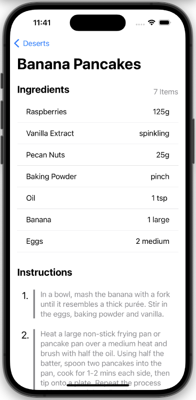

# About me

Hi! I'm Dhrushit 👋 

Pleasure to meet you.

I am a passionate iOS developer with a knack for building seamless and impactful digital experiences. With a strong foundation in both mobile and web development, I've successfully delivered features like an Instant Money Transfer system, driving over 3000 monthly transactions. I thrive in collaborative environments, enjoy tackling complex challenges, and am constantly seeking new opportunities to grow and innovate in the tech world.

# iOS Projects

## Desert Recipes

### Tech Stack

| Criteria | Tech |
| --- | --- |
| 💻 | Swift |
| 🎨 | SwiftUI |
|  |  |

  

### Description

The app, built with SwiftUI, offers a curated list of delicious desserts for users to explore. With a simple tap, users can view detailed recipes, including ingredients and step-by-step instructions. The app dynamically loads data, ensuring a fresh and diverse selection of dessert recipes is always available.

# From Courses

## Step Tracker

### Tech Stack

| Criteria | Tech |
| --- | --- |
| 💻 | Swift |
| 🎨 | SwiftUI |
| 📚 | HealthKit |

  

### Description

This app, built with SwiftUI as part of a Sean Allen course, leverages HealthKit to track and visualize health data effectively. It displays the number of steps taken in a bar chart, alongside a pie chart representing the average steps for each day of the week. Additionally, it features a weight chart using a line graph to show trends over time and a bar chart to highlight changes in weight over the past week. The app provides users with a clear and dynamic way to monitor their health metrics.

## Github Followers

### Tech Stack

| Criteria | Tech |
| --- | --- |
| 💻 | Swift |
| 🎨 | UIKit |
| 📀 | UserDefaults |

  

  

### Description

This app, developed as part of a Sean Allen course, allows users to manage their social connections effectively. It displays a list of followers using a Collection View and enables users to mark their favorite followers for easier tracking. Favorited followers are stored using User Defaults for persistent storage. The app also features a Table View to display the list of favorited followers, providing a streamlined way to organize and access important social contacts.