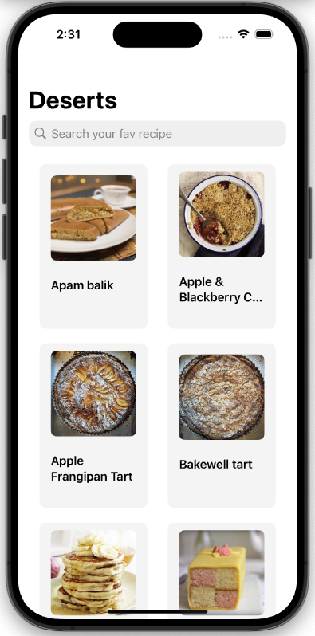

# About me

&nbsp;&nbsp;&nbsp;&nbsp;&nbsp;&nbsp;&nbsp;&nbsp;

Hi! I'm Dhrushit 👋 

Pleasure to meet you.

I am a passionate iOS developer with a knack for building seamless and impactful digital experiences. With a strong foundation in both mobile and web development, I've successfully delivered features like an Instant Money Transfer system, driving over 3000 monthly transactions. I thrive in collaborative environments, enjoy tackling complex challenges, and am constantly seeking new opportunities to grow and innovate in the tech world.

# iOS Projects

## [Desert Recipes](https://github.com/dhrushit-RIT/Fetch-Screening-Project)

### Tech Stack

| Criteria | Tech |
| --- | --- |
| 💻 | Swift |
| 🎨 | SwiftUI |

  

  

### Description

The app, built with SwiftUI, offers a curated list of delicious desserts for users to explore. With a simple tap, users can view detailed recipes, including ingredients and step-by-step instructions. The app dynamically loads data, ensuring a fresh and diverse selection of dessert recipes is always available.

- Implemented search, with recipe name
- `ScrollView` with `paging` style
- `Picker` for chosing type of information to show
- `Sheet` to present details about the recipe
- `AsyncImage` for asynchronous image fetching, with placeholder to prevent showing different layouts with and without image.

## [Step Tracker](https://github.com/dhrushit-RIT/step-tracker)

### Tech Stack

| Criteria | Tech |
| --- | --- |
| 💻 | Swift |
| 🎨 | SwiftUI |
| 📚 | HealthKit, SwiftCharts |

  

### Description

This app, built with SwiftUI as part of a Sean Allen course, leverages HealthKit to track and visualize health data effectively. It displays the number of steps taken in a bar chart, alongside a pie chart representing the average steps for each day of the week. Additionally, it features a weight chart using a line graph to show trends over time and a bar chart to highlight changes in weight over the past week. The app provides users with a clear and dynamic way to monitor their health metrics.

## [Github Followers](https://github.com/dhrushit-RIT/GithubFollowersProject)

### Tech Stack

| Criteria | Tech |
| --- | --- |
| 💻 | Swift |
| 🎨 | UIKit |
| 📀 | UserDefaults |

  

  

### Description

This app, developed as part of a Sean Allen course, allows users to manage their social connections effectively. It displays a list of followers using a `UICollectionView` and enables users to mark their favorite followers for easier tracking. Favorited followers are stored using User Defaults for persistent storage. The app also features a `UITableView` to display the list of favorited followers, providing a streamlined way to organize and access important social contacts.